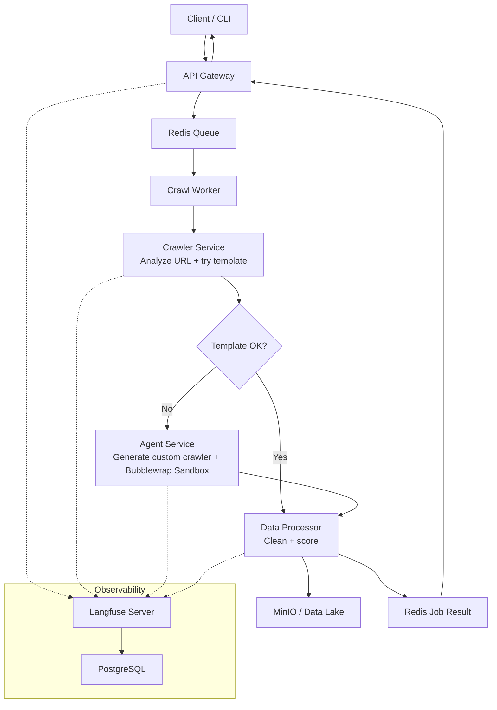
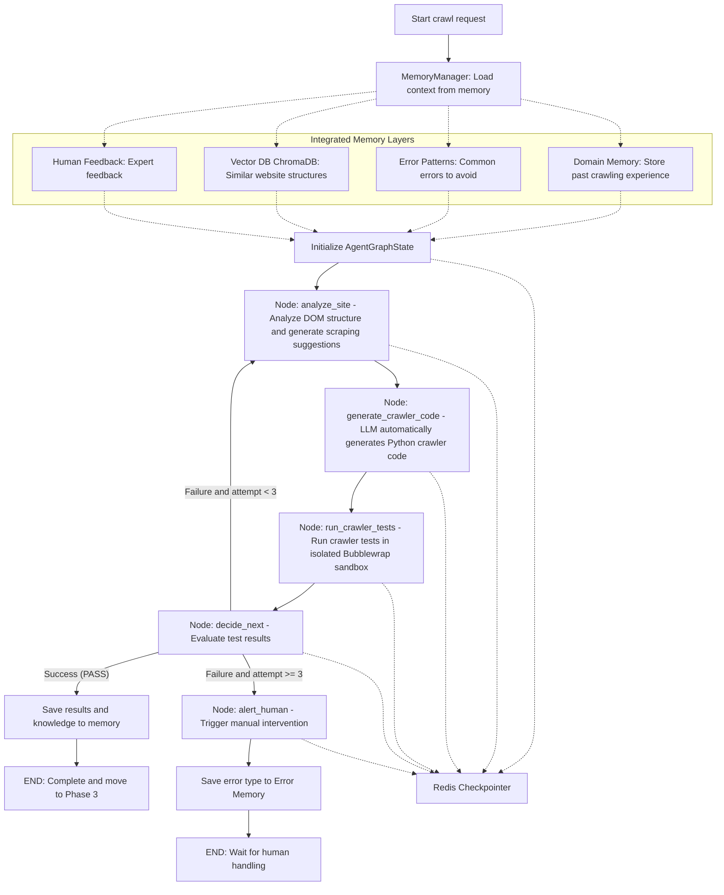

# Agent Crawler — Intelligent Web Data Crawling Platform

A microservices platform that automatically generates, tests, and deploys web crawlers using AI agents. Submit a URL and data spec — the system decides the best scraping strategy, generates custom code if templates fail, and delivers quality-scored clean data.

## Architecture



### Pipeline Phases

| Phase       | Service   | Description                                                     |
| ----------- | --------- | --------------------------------------------------------------- |
| **0** | Crawler   | Analyze URL → classify web type (STATIC/DYNAMIC/API/PAGINATED) |
| **1** | Crawler   | Try template fast path → validate output via gate checks       |
| **2** | Agent     | If template fails → LangGraph AI generates custom crawler code |
| **3** | Processor | Clean → deduplicate → quality score → persist to data lake   |

### Multi-Agent Workflow (LangGraph)

When the template fast path fails, the **Agent Service** triggers a resilient Multi-Agent workflow built using **LangGraph** and integrated with a 6-layer memory system (checkpointer, domain memory, conversation buffer, error patterns, vector knowledge base, and human feedback):



## Quick Start

```bash
# 1. Clone and configure
cp .env.example .env
# Edit .env — set strong infrastructure secrets and one LLM API key

# 2. Start all services
make dev
# or: docker compose up -d

# 3. Open API docs
open http://localhost:8000/docs

# 4. Submit a crawl job
curl -X POST http://localhost:8000/api/v1/crawl \
  -H "Content-Type: application/json" \
  -d '{
    "target": {"url": "https://example.com"},
    "data_spec": {"data_type": "products", "required_fields": ["name", "price"]}
  }'

# 5. Check status
curl http://localhost:8000/api/v1/crawl/{job_id}/status

# 6. Get result
curl http://localhost:8000/api/v1/crawl/{job_id}/result
```

### CLI

```bash
# Install CLI
pip install -e services/api-gateway

# Submit job with live progress
crawler crawl https://example.com -t products -f name -f price

# Check job status
crawler status <job_id>

# Get result
crawler result <job_id>

# List templates
crawler templates
```

## Development

```bash
# Run tests
make test                  # All services
make test-gateway          # API Gateway only
make test-crawler          # Crawler Service only
make test-processor        # Data Processor only

# Code quality
make lint                  # Ruff linter
make lint-fix              # Auto-fix issues
make format                # Format code

# Infrastructure
make redis-cli             # Redis CLI
make logs                  # Tail all logs
make logs-api-gateway      # Tail specific service
make status                # Show service status
make clean                 # Remove __pycache__
```

## API Reference

### `POST /api/v1/crawl` — Submit Crawl Job

Returns `202 Accepted` immediately. A separate durable worker claims the job
from Redis and recovers unacknowledged jobs after a worker restart.

**Request:**

```json
{
  "target": {"url": "https://example.com"},
  "data_spec": {
    "data_type": "products",
    "required_fields": ["name", "price", "url"]
  },
  "scope": {"max_pages": 50, "max_records": 1000},
  "output": {"format": "json", "destination": "data_lake"}
}
```

**Response (202):**

```json
{
  "job_id": "abc-123-def",
  "status": "queued",
  "status_url": "/api/v1/crawl/abc-123-def/status",
  "result_url": "/api/v1/crawl/abc-123-def/result"
}
```

### `GET /api/v1/crawl/{id}/status` — Job Progress

```json
{
  "job_id": "abc-123-def",
  "status": "running",
  "phase": "phase2_agent",
  "progress": 0.45,
  "created_at": "2026-06-05T02:30:00Z",
  "updated_at": "2026-06-05T02:31:30Z"
}
```

### `GET /api/v1/crawl/{id}/result` — Full Result

```json
{
  "status": "completed",
  "result": {
    "request_id": "abc-123-def",
    "status": "success",
    "phase_used": "template",
    "raw_records": [...],
    "clean_records": [...],
    "quality": {"overall_score": 87.5, "grade": "good"},
    "output_path": "s3://crawler-clean/data/20260605_abc.json"
  }
}
```
