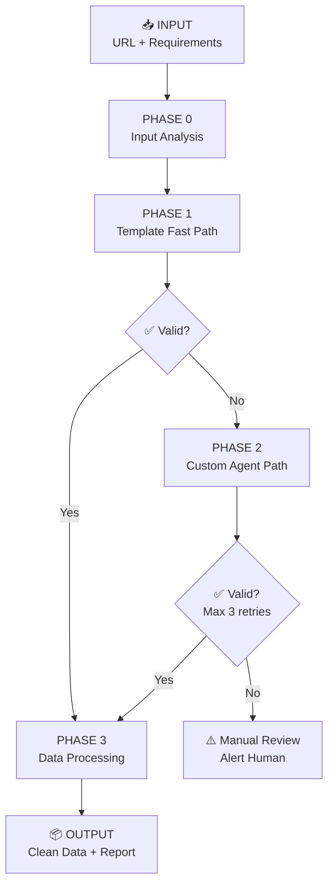
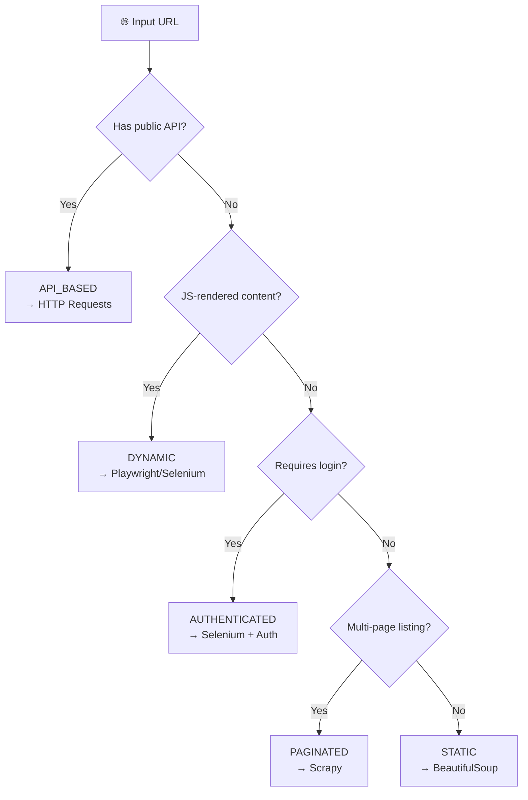
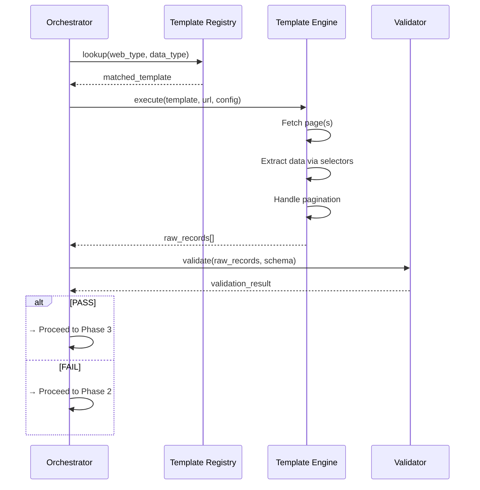
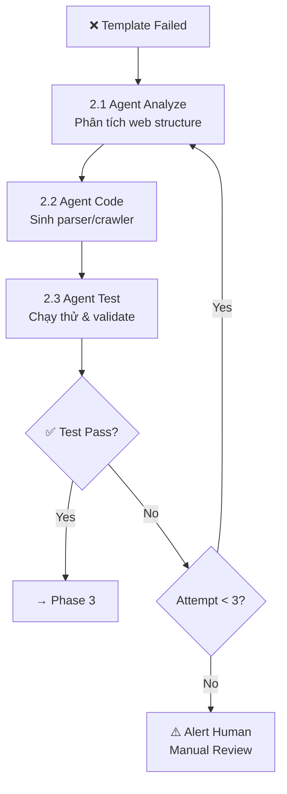
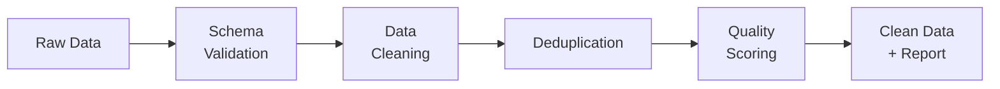
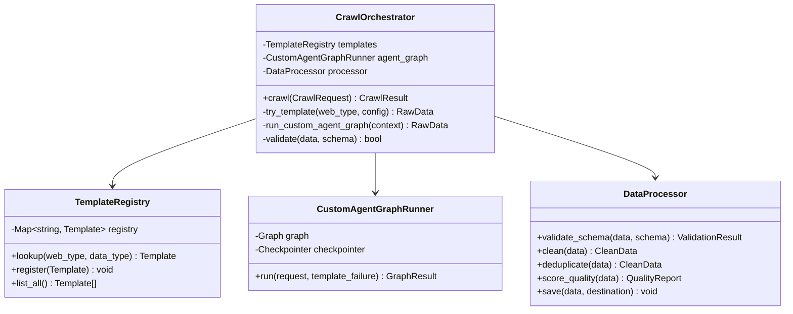

# 📋 Agent Crawler Data — Business Analysis & System Design Document

> **Document Version:** 1.0  
> **Author:** Senior Business Analyst  
> **Created:** 2026-05-01  
> **Status:** Draft — Pending Review  
> **Project:** Agent Crawler Data  

---

## 1. Executive Summary

Hệ thống **Agent Crawler Data** là một nền tảng thu thập dữ liệu web thông minh, kết hợp giữa **template-based automation** (Fast Path) và **AI-agent-driven custom development** (Slow Path). Hệ thống tự động phân loại website, chọn chiến lược cào phù hợp, và xử lý dữ liệu đầu ra với tiêu chuẩn chất lượng cao.

### 1.1 Business Objectives

| # | Objective | KPI |
|---|-----------|-----|
| O1 | Tự động hóa thu thập dữ liệu web | ≥ 80% tasks hoàn thành không cần can thiệp thủ công |
| O2 | Đảm bảo chất lượng dữ liệu | Data quality score ≥ 90% |
| O3 | Giảm thời gian phát triển crawler | Từ 2-3 ngày → < 30 phút với template |
| O4 | Xử lý đa dạng loại website | Hỗ trợ ≥ 5 web types (static, dynamic, API, paginated, authenticated) |

### 1.2 Stakeholders

| Role | Responsibility |
|------|---------------|
| Data Engineer | Cấu hình & giám sát pipeline |
| AI Agent (LLM) | Phân tích web, sinh code crawler tự động |
| QA / Validator | Kiểm tra chất lượng dữ liệu đầu ra |
| End User | Tiêu thụ dữ liệu sạch (JSON/CSV/DB) |

---

## 2. System Architecture Overview



---

## 3. Detailed Workflow Specification

### PHASE 0 — Input Analysis (Phân Tích Đầu Vào)

> **Mục tiêu:** Thu thập & xác nhận đầy đủ thông tin trước khi bắt đầu crawl.

#### 3.0.1 Input Schema

```json
{
  "request_id": "uuid-v4",
  "target": {
    "url": "https://example.com/products",
    "domain": "example.com",
    "web_type": null
  },
  "data_spec": {
    "data_type": "products | articles | comments | prices | user_info | custom",
    "required_fields": ["name", "price", "url"],
    "optional_fields": ["rating", "description", "image_url"]
  },
  "scope": {
    "mode": "full | paginated | single_page",
    "max_pages": 100,
    "max_records": 10000
  },
  "output": {
    "format": "json | csv | parquet | delta",
    "destination": "local_file | s3 | data_lake"
  },
  "schedule": {
    "frequency": "one_time | hourly | daily | weekly | real_time",
    "start_time": "2026-05-01T00:00:00Z"
  },
  "constraints": {
    "rate_limit_rps": 2,
    "respect_robots_txt": true,
    "requires_auth": false,
    "auth_config": null,
    "proxy_required": false
  }
}
```

#### 3.0.2 Web Type Classification



#### 3.0.3 Classification Rules

| Signal | Detection Method | Web Type |
|--------|-----------------|----------|
| `<script>` tags with React/Vue/Angular | DOM inspection | DYNAMIC |
| `__NEXT_DATA__`, `window.__STATE__` | Page source scan | DYNAMIC |
| `/api/v*` endpoints in network tab | Network analysis | API_BASED |
| `?page=`, `&offset=`, pagination links | URL pattern + DOM | PAGINATED |
| Login form, 401/403 responses | HTTP status + DOM | AUTHENTICATED |
| Plain HTML, no JS frameworks | Page source scan | STATIC |

> [!IMPORTANT]
> Phase 0 output (`web_type`) quyết định toàn bộ strategy ở Phase 1. Nếu phân loại sai → template sẽ fail → phải fallback sang Phase 2.

---

### PHASE 1 — Template Fast Path (Đường Nhanh)

> **Mục tiêu:** Sử dụng template có sẵn để cào dữ liệu nhanh chóng. Target: hoàn thành trong < 5 phút.

#### 3.1.1 Template Registry

| Template ID | Web Type | Tool Stack | Use Case |
|-------------|----------|------------|----------|
| `TPL-001` | STATIC | `requests` + `BeautifulSoup` | Blog, wiki, news articles |
| `TPL-002` | DYNAMIC | `Playwright` + `BS4` | SPA, React/Vue apps |
| `TPL-003` | API_BASED | `requests` + `json` | REST API endpoints |
| `TPL-004` | PAGINATED | `Scrapy` | E-commerce listings, search results |
| `TPL-005` | AUTHENTICATED | `Selenium` + `requests` | Login-required portals |
| `TPL-006` | PAGINATED + DYNAMIC | `Scrapy` + `Playwright` | Infinite scroll listings |

#### 3.1.2 Template Configuration Schema

```json
{
  "template_id": "TPL-001",
  "template_name": "static_article_scraper",
  "tool_stack": ["requests", "beautifulsoup4"],
  "selectors": {
    "container": "div.article-list",
    "item": "article.post",
    "fields": {
      "title": {"selector": "h2.title", "type": "text"},
      "content": {"selector": "div.body", "type": "html"},
      "date": {"selector": "time", "attribute": "datetime", "type": "date"},
      "author": {"selector": "span.author", "type": "text"},
      "url": {"selector": "a.permalink", "attribute": "href", "type": "url"}
    }
  },
  "pagination": {
    "type": "next_button | page_number | load_more | infinite_scroll",
    "selector": "a.next-page",
    "max_pages": 100
  },
  "rate_limit": {
    "requests_per_second": 2,
    "delay_between_pages_ms": 1000
  },
  "headers": {
    "User-Agent": "Mozilla/5.0 (compatible; DataBot/1.0)"
  }
}
```

#### 3.1.3 Execution Flow



#### 3.1.4 Validation Criteria (Gate Check)

| # | Criterion | Condition | Priority |
|---|-----------|-----------|----------|
| V1 | Record count | `count > 0` | CRITICAL |
| V2 | Required fields completeness | `empty_rate < 10%` cho required fields | CRITICAL |
| V3 | Data format match | Tất cả fields match expected type | HIGH |
| V4 | No exceptions | Zero unhandled errors | CRITICAL |
| V5 | Reasonable values | Không có giá trị bất thường (e.g., price = 0) | MEDIUM |

> **Decision Rule:**  
> - ALL CRITICAL passed + ≥ 1 HIGH passed → ✅ **PASS** → Phase 3  
> - ANY CRITICAL failed → ❌ **FAIL** → Phase 2

---

### PHASE 2 — Custom Agent Development (Đường Chậm)

> **Mục tiêu:** Khi template thất bại, hệ thống chạy **LangGraph workflow** để tự động phân tích website, sinh code crawler tùy chỉnh, chạy test/validate và lặp tối đa 3 lần trước khi escalate.

#### 3.2.1 Agent Pipeline



> **Implementation Note:** Pipeline trên sẽ được hiện thực bằng **LangGraph** (stateful graph) với conditional edges và retry counter trong state.

#### 3.2.1.1 LangGraph Graph Spec (Khuyến nghị)

**Graph Name:** `custom_agent_graph`

**State (shared across nodes):**

```json
{
  "request": {
    "request_id": "uuid-v4",
    "target": {"url": "https://example.com/products", "domain": "example.com", "web_type": "DYNAMIC"},
    "data_spec": {"data_type": "products", "required_fields": ["name", "price", "url"], "optional_fields": []},
    "scope": {"mode": "paginated", "max_pages": 100, "max_records": 10000},
    "constraints": {"rate_limit_rps": 2, "respect_robots_txt": true, "requires_auth": false, "proxy_required": false}
  },
  "template_failure": {
    "template_id": "TPL-002",
    "reason": "SelectorNotFound",
    "error_log_excerpt": "..."
  },
  "attempt": 1,
  "analysis": null,
  "generated": {
    "files": [],
    "entrypoint": null
  },
  "test": {
    "passed": false,
    "metrics": {},
    "errors": []
  },
  "raw_records": [],
  "decision": null,
  "audit": {
    "phase_used": "custom_agent",
    "events": []
  }
}
```

**Nodes:**

| Node ID | Responsibility | Output to State |
|--------|-----------------|-----------------|
| `analyze_site` | Render/inspect site, detect selectors/pagination/challenges | `analysis` |
| `generate_crawler_code` | Generate code + config files from `analysis` | `generated` |
| `run_crawler_tests` | Execute crawler on small matrix, validate output schema | `test`, `raw_records` |
| `decide_next` | Route: pass → Phase 3; fail → retry or alert | `decision` |
| `alert_human` | Emit alert with context, stop | terminal |

**Edges (routing):**

- `START` → `analyze_site` → `generate_crawler_code` → `run_crawler_tests` → `decide_next`
- In `decide_next`:
  - If `test.passed == true` → `END` (handoff to Phase 3)
  - Else if `attempt < 3` → increment `attempt` → `analyze_site`
  - Else → `alert_human` → `END`

**Persistence / Checkpointing:**

- Use LangGraph checkpointing để resume theo `request_id` (crash/timeout vẫn resume được).

#### 3.2.2 Sub-phase: Agent Analyze

**Input:** URL + Phase 0 analysis + template failure reason

**Agent Tasks:**

| Task | Method | Output |
|------|--------|--------|
| Inspect HTML/DOM | Headless browser render → parse | DOM tree structure |
| Detect CSS selectors | Pattern matching trên DOM | Selector map |
| Identify pagination | URL pattern + link analysis | Pagination strategy |
| Check rate limiting | Test burst requests | Rate limit config |
| Detect dynamic loading | Monitor network requests | AJAX/WS endpoints |
| Detect anti-bot | Check for CAPTCHA, fingerprinting | Bypass strategy |

**Output Schema:**

```json
{
  "analysis_id": "uuid",
  "url": "https://example.com",
  "dom_structure": {
    "content_container": "div#main-content",
    "item_selector": "div.card-item",
    "field_map": {
      "title": {"selector": "h3.item-title", "method": "text"},
      "price": {"selector": "span.price-value", "method": "text", "transform": "parse_currency"},
      "image": {"selector": "img.product-img", "method": "attribute", "attr": "src"}
    }
  },
  "pagination": {
    "type": "page_number",
    "pattern": "?page={n}",
    "total_pages": 45
  },
  "challenges": [
    {"type": "rate_limit", "detail": "Max 5 req/s detected"},
    {"type": "lazy_load", "detail": "Images loaded via IntersectionObserver"}
  ],
  "recommendation": {
    "tool": "playwright",
    "strategy": "render_then_parse",
    "estimated_time_minutes": 15
  }
}
```

#### 3.2.3 Sub-phase: Agent Code

**Input:** Analysis report từ 3.2.2

**Code Generation Rules:**

| Rule | Description |
|------|-------------|
| R1 | Phải có error handling cho mọi HTTP request |
| R2 | Retry logic với exponential backoff |
| R3 | Respect `rate_limit` từ analysis |
| R4 | Handle missing fields gracefully (return `null`, không crash) |
| R5 | Logging cho mỗi page crawled |
| R6 | Output phải conform với `data_spec.required_fields` |

**Generated Code Structure:**

```
generated_crawlers/
├── crawler_{request_id}.py      # Main crawler script
├── config_{request_id}.json     # Runtime config
├── selectors_{request_id}.json  # CSS/XPath selectors
└── test_{request_id}.py         # Auto-generated test
```

#### 3.2.4 Sub-phase: Agent Test

**Test Matrix:**

| Test Case | Input | Expected | Priority |
|-----------|-------|----------|----------|
| TC1: Single page | 1 URL | ≥ 1 record, all required fields | CRITICAL |
| TC2: Pagination | First 3 pages | Records from all 3 pages | HIGH |
| TC3: Missing data | Page with incomplete items | Graceful handling, null fields | HIGH |
| TC4: Error handling | Invalid URL | Clean error, no crash | MEDIUM |
| TC5: Performance | 10 pages | < 60 seconds total | MEDIUM |

#### 3.2.5 Retry Policy

```
MAX_RETRIES = 3
┌──────────────────────────────────────────────────┐
│ Attempt 1: Run as-is                             │
│   └─ Fail → Error analysis → Identify root cause │
│                                                  │
│ Attempt 2: Fix selectors + adjust strategy       │
│   └─ Fail → Deeper DOM analysis → Alternative    │
│                                                  │
│ Attempt 3: Complete rewrite with different tool   │
│   └─ Fail → ⚠️ ESCALATE to human               │
└──────────────────────────────────────────────────┘
```

> [!WARNING]
> Sau 3 lần thất bại, hệ thống **PHẢI** dừng và gửi alert. Không được retry vô hạn để tránh waste resources và potential IP ban.

---

### PHASE 3 — Data Processing & Storage

> **Mục tiêu:** Làm sạch, validate, và lưu trữ dữ liệu đã cào.

#### 3.3.1 Processing Pipeline



#### 3.3.2 Schema Validation Rules

| Rule | Check | Action on Fail |
|------|-------|----------------|
| Required fields present | All fields in `required_fields` exist | Reject record |
| Type validation | Field values match expected types | Attempt cast → reject if fail |
| URL format | Valid URL pattern | Flag as suspicious |
| Date format | Parseable date string | Normalize or flag |
| Price/Number format | Numeric after cleaning | Attempt parse → null if fail |

#### 3.3.3 Data Cleaning Operations

| Operation | Example | Method |
|-----------|---------|--------|
| Trim whitespace | `"  iPhone 15  "` → `"iPhone 15"` | `str.strip()` |
| Remove HTML tags | `"<b>Bold</b>"` → `"Bold"` | Regex / BS4 |
| Normalize unicode | `"Café"` → `"Café"` (NFC) | `unicodedata.normalize` |
| Parse currency | `"$1,299.00"` → `1299.00` | Regex + float |
| Parse dates | `"May 1, 2026"` → `"2026-05-01"` | `dateutil.parser` |
| Normalize URLs | Relative → Absolute | `urljoin(base, path)` |

#### 3.3.4 Quality Scoring

```
Quality Score = weighted average of:
  ├─ Completeness (40%): % records with all required fields
  ├─ Validity (30%):     % fields passing type validation
  ├─ Uniqueness (20%):   % records after dedup / total
  └─ Freshness (10%):    Age of data vs. crawl time
```

| Score Range | Grade | Action |
|-------------|-------|--------|
| 90-100% | 🟢 Excellent | Auto-approve, save to production |
| 70-89% | 🟡 Good | Save with warning flag |
| 50-69% | 🟠 Fair | Require review before save |
| < 50% | 🔴 Poor | Reject, trigger re-crawl |

#### 3.3.5 Output Formats

| Format | Use Case | Storage |
|--------|----------|---------|
| JSON | API consumption, flexible schema | Local / S3 |
| CSV | Analysis, spreadsheet import | Local / S3 |
| Parquet / Delta | Structured querying, analytics | Data Lake (S3 / MinIO) |

#### 3.3.6 Audit Log Schema

```json
{
  "audit_id": "uuid",
  "request_id": "uuid",
  "timestamp": "2026-05-01T20:30:00Z",
  "source_url": "https://example.com/products",
  "phase_used": "template | custom_agent",
  "template_id": "TPL-001 | null",
  "attempts": 1,
  "records_raw": 1500,
  "records_clean": 1423,
  "records_rejected": 77,
  "quality_score": 94.8,
  "duration_seconds": 120,
  "status": "success | partial | failed",
  "errors": []
}
```

---

## 4. Core Component Design

### 4.1 Class Diagram



### 4.2 Error Handling Strategy

| Error Type | Handling | Retry? |
|------------|----------|--------|
| `ConnectionError` | Log + retry with backoff | Yes (3x) |
| `TimeoutError` | Increase timeout + retry | Yes (2x) |
| `403 Forbidden` | Switch User-Agent / proxy | Yes (1x) |
| `404 Not Found` | Skip URL, log warning | No |
| `CAPTCHA Detected` | Alert human | No |
| `Rate Limited (429)` | Exponential backoff | Yes (3x) |
| `Selector Not Found` | Trigger Phase 2 re-analysis | Yes (in Phase 2) |
| `Parse Error` | Log record, continue others | No (per record) |

---

## 5. Technology Stack

| Layer | Technology | Justification |
|-------|-----------|---------------|
| **Language** | Python 3.11+ | Rich ecosystem cho web scraping |
| **Static Scraping** | `requests` + `BeautifulSoup4` | Lightweight, fast |
| **Dynamic Scraping** | `Playwright` | Modern, async, multi-browser |
| **Crawl Framework** | `Scrapy` | Production-grade, built-in throttling |
| **Auth Automation** | `Selenium` | Legacy support, complex auth flows |
| **AI Agent Orchestration** | `langgraph` | Stateful workflow, conditional routing, retries, checkpointing |
| **LLM Provider** | Claude API (Anthropic) | Code generation + analysis (pluggable) |
| **Task Queue** | Celery + Redis | Async job processing |
| **Storage** | Data Lake | Scalable, unstructured & structured data storage |
| **Monitoring** | Grafana + Prometheus | Pipeline observability |
| **Logging** | Python `logging` + ELK | Centralized log management |

---

## 6. Project Structure

```
Agent_crawler_data/
├── README.md
├── pyproject.toml
├── docker-compose.yml
├── .env.example
│
├── src/
│   ├── __init__.py
│   ├── orchestrator.py          # CrawlOrchestrator - main entry
│   ├── analyzer.py              # Phase 0: Input analysis & web classification
│   │
│   ├── templates/               # Phase 1: Template registry
│   │   ├── __init__.py
│   │   ├── registry.py          # Template lookup & management
│   │   ├── base_template.py     # Abstract template class
│   │   ├── static_scraper.py    # TPL-001: BeautifulSoup
│   │   ├── dynamic_scraper.py   # TPL-002: Playwright
│   │   ├── api_scraper.py       # TPL-003: HTTP/API
│   │   ├── paginated_scraper.py # TPL-004: Scrapy
│   │   └── auth_scraper.py      # TPL-005: Selenium + Auth
│   │
│   ├── graphs/                  # Phase 2: LangGraph workflows
│   │   ├── __init__.py
│   │   ├── custom_agent_graph.py    # Graph definition (nodes + edges)
│   │   ├── state.py                 # Graph state schema (TypedDict / Pydantic)
│   │   ├── nodes/
│   │   │   ├── __init__.py
│   │   │   ├── analyze_site.py      # Node: analyze_site
│   │   │   ├── generate_code.py     # Node: generate_crawler_code
│   │   │   ├── run_tests.py         # Node: run_crawler_tests
│   │   │   └── decide_next.py       # Node: decide_next
│   │   └── checkpoints/
│   │       └── __init__.py          # Checkpoint adapters (file/sql/redis)
│   │
│   ├── processing/              # Phase 3: Data processing
│   │   ├── __init__.py
│   │   ├── validator.py         # Schema validation
│   │   ├── cleaner.py           # Data cleaning
│   │   ├── deduplicator.py      # Duplicate removal
│   │   ├── scorer.py            # Quality scoring
│   │   └── storage.py           # Output & persistence
│   │
│   ├── models/                  # Data models
│   │   ├── __init__.py
│   │   ├── request.py           # CrawlRequest schema
│   │   ├── result.py            # CrawlResult schema
│   │   └── audit.py             # AuditLog schema
│   │
│   └── utils/
│       ├── __init__.py
│       ├── http_client.py       # Shared HTTP utilities
│       ├── logger.py            # Logging config
│       └── config.py            # App configuration
│
├── generated_crawlers/          # Runtime-generated custom crawlers
│
├── configs/
│   └── templates/               # Template JSON configs
│       ├── tpl_001_static.json
│       ├── tpl_002_dynamic.json
│       └── ...
│
├── tests/
│   ├── unit/
│   ├── integration/
│   └── fixtures/
│
└── docs/
    ├── architecture.md
    └── template_guide.md
```

---

## 7. Non-Functional Requirements

| Category | Requirement | Target |
|----------|-------------|--------|
| **Performance** | Single page scrape | < 5 seconds |
| **Performance** | 100-page crawl | < 10 minutes |
| **Reliability** | Success rate with templates | ≥ 80% |
| **Reliability** | Success rate with agent fallback | ≥ 95% |
| **Scalability** | Concurrent crawl jobs | ≥ 10 |
| **Security** | Respect robots.txt | Always (configurable) |
| **Security** | Rate limiting compliance | Configurable per domain |
| **Observability** | Audit trail coverage | 100% of crawl jobs |
| **Data Quality** | Minimum quality score for auto-save | ≥ 70% |

---

## 8. Risk Assessment

| Risk | Impact | Probability | Mitigation |
|------|--------|-------------|------------|
| IP blocked by target site | 🔴 High | Medium | Proxy rotation, rate limiting |
| Website structure changes | 🟡 Medium | High | Agent auto-repair, monitoring |
| LLM generates incorrect code | 🟡 Medium | Medium | 3-retry limit, test validation |
| Data privacy violations | 🔴 High | Low | robots.txt compliance, PII detection |
| Template registry becomes stale | 🟡 Medium | Medium | Periodic validation, versioning |

---

## 9. Success Metrics

| Metric | Formula | Target |
|--------|---------|--------|
| Template Hit Rate | `template_success / total_requests` | ≥ 80% |
| Agent Recovery Rate | `agent_success / template_failures` | ≥ 75% |
| Overall Success Rate | `(template + agent success) / total` | ≥ 95% |
| Avg Time to Data | `mean(crawl_duration)` | < 10 min |
| Data Quality Score | `mean(quality_score)` | ≥ 90% |
| Manual Intervention Rate | `human_alerts / total` | ≤ 5% |

---

## Verification Plan

### Automated Tests
- Unit tests cho từng component (template, agent, processor)
- Integration tests cho full pipeline flow
- `pytest` + `pytest-asyncio` cho async components

### Manual Verification
- Crawl thử 5 websites thuộc 5 loại khác nhau
- Verify data quality output trên real data
- Load test với 10 concurrent jobs

---

## Decisions (Resolved)

| # | Question | Decision |
|---|----------|----------|
| Q1 | Proxy rotation | ✅ **Có** — Hỗ trợ ngay v1.0 |
| Q2 | LLM Provider | ✅ **Claude + GPT-4** — Pluggable architecture, hỗ trợ cả hai |
| Q3 | Data Lake solution | ✅ **MinIO** — Self-hosted, S3-compatible |
| Q5 | Template configs | ✅ **Trong code repo** — Quản lý bằng JSON files trong `configs/templates/` |

## Open Questions

> [!NOTE]
> **Q4:** Có cần build Web UI dashboard để monitor crawl jobs không, hay CLI là đủ cho v1.0?
